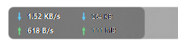
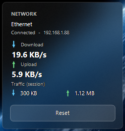

# Taskbar Network Lounge

A compact, native network monitor that lives on the Windows 11 taskbar — live
download/upload speed plus total traffic — in the same place, size and acrylic
style as [Taskbar Music Lounge](https://windhawk.net/mods/taskbar-music-lounge).

Built as a [Windhawk](https://windhawk.net/) **tool mod**: pure C++ with GDI+ and
the IP Helper API, no external app, no console window, no runtime, fully offline.



Click it for an acrylic details panel with a Reset button:



## Features

* **Live speed** — download and upload, computed from the interface octet
  counters (`GetIfTable2`) divided by the *measured* elapsed time
  (`QueryPerformanceCounter`), never from an assumed timer period. No
  `ipconfig`/`netstat` parsing, no PowerShell.
* **Total traffic** — session totals, or persistent totals that survive
  Explorer / Windhawk / Windows restarts (small file in `%LOCALAPPDATA%`,
  written at most every 30 s and on unload, atomic replace, checksum-validated).
* **Smart adapter selection** — Auto (the adapter that carries the default
  route), Ethernet only, Wi-Fi only, all active adapters, or one specific
  adapter by name. Loopback, tunnels, VPN, VMware, Hyper-V, Docker, TAP,
  Bluetooth PAN and other non-physical adapters are filtered out by default.
* **Three layouts** — speeds + totals in two columns, speeds only in two rows,
  or a single line.
* **Bytes vs bits, never mixed up** — `MB/s` = megabytes per second,
  `Mbps` = megabits per second (1 byte = 8 bits). The unit is always drawn next
  to the number.
* **Native look** — GDI+ anti-aliased vector arrows and ClearType text, DWM
  rounded corners, acrylic blur, Segoe UI, automatic light/dark theme.
* **Rich tooltip** on hover; **details panel** on click; **context menu** on
  right click (refresh, reset download/upload/both, open Windows network
  settings, Windhawk settings, hide).
* **Robust** — survives Explorer restarts, taskbar auto-hide, adapter
  disconnect/reconnect, VPN toggling, sleep/wake, DPI and resolution changes.
  Shows `No Network` / `Disconnected` instead of stale numbers.
* **Cheap** — one `GetIfTable2` call per interval on a worker thread, repaint
  only when the displayed values actually change. Measured at **0.3 % of one
  core** and a flat ~27 MB working set (see [Measurements](#measurements)).

## Installation

1. Install [Windhawk](https://windhawk.net/) (Windows 10 or 11).
2. Windhawk → **Explore** → **Create a new mod**.
3. Delete the template and paste the contents of
   [`taskbar-network-lounge.wh.cpp`](taskbar-network-lounge.wh.cpp).
4. Press **Compile mod**, then enable it.

The mod runs in its own dedicated process (`explorer.exe -tool-mod
"local@taskbar-network-lounge"`), so a fault in the mod cannot take down the
shell, and it is not loaded into every Explorer window.

### Command-line install (no GUI)

With an elevated shell:

```bash
python install.py            # compile + register + write default settings
python install.py --no-settings   # keep existing settings
```

`install.py` does exactly what the Windhawk editor does: writes the source to
`%PROGRAMDATA%\Windhawk\ModsSource`, compiles it with Windhawk's bundled clang
into `Engine\Mods\64`, and writes the `HKLM\SOFTWARE\Windhawk\Engine\Mods` entry
plus the default settings, bumping `SettingsChangeTime` so the engine reloads.

## Settings

### Appearance

| Setting | Default | Notes |
| --- | --- | --- |
| Panel width | 200 | logical pixels at 100 % scaling |
| Panel height | 48 | |
| Font size | 11 | |
| Layout | Speeds + totals | `full`, `speeds` (two rows), `oneline` |
| X offset | 12 | from the taskbar's left edge (top edge if vertical) |
| Y offset | 0 | |
| Scale with DPI | on | multiply everything by the monitor scaling |
| Auto theme | on | follow the Windows light/dark theme |
| Manual text color | `0xFFFFFF` | used only when Auto theme is off |
| Colored arrows | on | blue download, green upload; off = monochrome |
| Acrylic tint opacity | 0 | 0–255; 0 keeps pure glass |

### Network

| Setting | Default | Notes |
| --- | --- | --- |
| Interface mode | Auto | `auto`, `ethernet`, `wifi`, `all`, `specific` |
| Specific interface | *(empty)* | name or part of the name/description |
| Ignore virtual adapters | on | loopback, tunnels, VPN, VMware, Hyper-V, Docker, TAP, Bluetooth |
| Update interval | 1000 ms | clamped to 250–5000 ms |
| Speed unit | Auto | `auto`/`bytes` → MB/s, `bits` → Mbps |
| 1024-based byte units | on | off = 1 MB is 1 000 000 bytes; bit units are always 1000-based |

### Traffic

| Setting | Default | Notes |
| --- | --- | --- |
| Traffic counter mode | Session | `session` or `persistent` |
| Reset traffic counters | Do not reset | `download`, `upload`, `both` — applied once when the value changes |

Windhawk settings cannot contain a real push button, so **Reset traffic
counters** is a dropdown: pick a value, save, and the reset fires once. The
previously applied value is remembered in the mod's own storage, so the counters
are not wiped on every settings read. The details panel's **Reset** button and
the right-click menu do the same thing without touching settings.

### Behavior

| Setting | Default | Notes |
| --- | --- | --- |
| Show tooltip on hover | on | |
| Show details panel on click | on | |
| Hide when fullscreen | off | uses `SHQueryUserNotificationState` |
| Start enabled | on | off keeps the widget hidden |

## Supported Windows versions

* **Windows 11** — full support (rounded corners + acrylic). Developed and
  tested on 10.0.26100 (24H2).
* **Windows 10** — works; corners are square because DWM has no rounding.
* x86-64. The source has no architecture-specific code, so Windhawk can also
  compile it for ARM64, but that has not been tested here.

## Architecture

Single self-contained `.wh.cpp`, assembled from the parts in `src/`:

| Part | Contents |
| --- | --- |
| `p1_header.inc` | Windhawk metadata, readme and settings blocks |
| `p2_core.inc` | includes, undocumented DWM/z-band declarations, settings struct, shared state |
| `p3_settings.inc` | settings loading, speed/byte formatters, persistent counter file |
| `p4_network.inc` | `NetworkMonitor`: `GetIfTable2` sampling, interface selection, worker thread |
| `p5_render.inc` | theme, acrylic, `DrawNetworkPanel`, `DrawDetailsPanel` |
| `p6_window.inc` | taskbar geometry, event hook, tooltip, details panel, context menu |
| `p7_lifecycle.inc` | widget window proc, UI thread, `WhTool_Mod*` callbacks, tool-mod launcher |

Threading model:

* **UI thread** — owns both windows, GDI+ and the message loop. `WM_PAINT` only
  draws the last published snapshot; it never calls a network API.
* **Worker thread** — samples `GetIfTable2` every *Update interval*, waits on two
  events (stop / wake) so it never busy-waits, publishes a `NetSnapshot` under a
  mutex and posts `APP_WM_DATA_UPDATED` **only when a displayed value changed**.
* Settings are read under their own mutex and copied by value, so the worker and
  the UI never block each other.

The window is a `WS_POPUP` layered tool window (`WS_EX_LAYERED |
WS_EX_TOOLWINDOW | WS_EX_TOPMOST | WS_EX_NOACTIVATE`), created with
`CreateWindowInBand(ZBID_IMMERSIVE_NOTIFICATION)` when available and
`CreateWindowEx` otherwise. No taskbar button, no Alt+Tab, never activated when
moved or repainted, but fully interactive (not click-through).

Positioning is always relative to the `Shell_TrayWnd` rectangle, re-evaluated on
an `EVENT_OBJECT_LOCATIONCHANGE` hook scoped to the taskbar thread, on
`TaskbarCreated`, on `WM_DPICHANGED`/`WM_DISPLAYCHANGE`, and by a 2-second
watchdog that also detects Explorer restarts.

## Build

Windhawk ships its own clang + mingw-w64 toolchain, so nothing else is needed.

```bash
bash build.sh                 # regenerate the .wh.cpp and compile a test DLL
bash tests/run_all.sh         # geometry + render/leak + formatter/persistence/live tests
python install.py             # install into Windhawk (elevated)
```

`build.sh` compiles with `-Wall -Wextra`; the build is warning-free.

### Development helpers (`tools/`)

| Tool | Purpose |
| --- | --- |
| `dbgmon.cpp` | minimal `OutputDebugString` monitor — reads `Wh_Log()` output without the Windhawk GUI |
| `winfind.cpp` | list windows by class/title with styles and rects |
| `shot.cpp` | capture a screen region to PNG (`CAPTUREBLT`, so layered windows are included) |
| `uitest.cpp` | drive the widget: hover, click, right click, click the panel's Reset |
| `taskbartest.cpp` | non-destructive taskbar tests: broadcast `TaskbarCreated`, hide/restore the taskbar |
| `dpitest.cpp` | report per-monitor DPI and the widget's physical vs logical size |
| `dpiscale.cpp` | get/set the display scaling at runtime (DisplayConfig DPI ioctl) |
| `setopt.py` | change a setting and trigger a live settings reload |
| `modstatus.py` | read Windhawk's per-process mod status files |
| `perfcheck.ps1` | CPU / working set / handle / GDI+USER object deltas over a window |
| `accuracy_integral.ps1` | integrate Windows' own perf counters and compare with the mod's totals |

## Measurements

Verified on this machine (Windows 11 10.0.26100.4652, Realtek PCIe GbE, 100 Mbit
link, 1920×1080 @ 100 %):

**Accuracy** — the mod's byte totals versus Windows' own
`\Network Interface(*)\Bytes Received/sec` counters (the source Task Manager's
Performance tab uses), integrated over the same 22-second window with a real
download running:

| | Download | Upload |
| --- | --- | --- |
| Perf counter integral | 67 569 314 B | 2 818 434 B |
| Mod sampler total | 67 611 056 B | 2 820 786 B |
| Ratio | **1.0006** | **1.0008** |

**Cost** — the dedicated tool-mod process, 30 s and 45 s windows, 1 s interval:

| Metric | Value |
| --- | --- |
| CPU | 0.094 s / 30 s = **0.31 % of one core** (0.026 % of a 12-thread CPU) |
| Working set | 27.05 → 27.06 MB (**+4 KB**) |
| Handles | 261 → 261 (**0**) |
| GDI / USER objects | 11 / 15, stable |
| Threads | 7 |

**Leak check** — 1500 iterations of drawing the widget and the details panel into
offscreen DCs: GDI +1, USER +2 total (GDI+ internals, not per-iteration).

## Troubleshooting

**The widget does not appear.**
Check that the mod is enabled and that the process exists:
`Get-CimInstance Win32_Process -Filter "Name='explorer.exe'"` should list
`-tool-mod "local@taskbar-network-lounge"`. Enable logging for the mod in
Windhawk and watch the log, or run `build/dbgmon.exe 30` (it needs no debugger).

**It overlaps the Start button or Widgets.**
Increase *X offset*, or turn off Taskbar Settings → Widgets.

**It shows `No Network` while I am online.**
Interface mode is probably too narrow (e.g. Ethernet only while you are on
Wi-Fi), or your adapter is being filtered as virtual. Set Interface mode to
`all`, or turn off *Ignore virtual adapters*, and check the log line
`Selected interface: ...`.

**A VPN is up and the numbers look wrong.**
VPN adapters are filtered by default, so you see the physical adapter's traffic
(encrypted, slightly larger than the payload). To count the tunnel instead, set
Interface mode to `specific` and name the VPN adapter, or turn off *Ignore
virtual adapters*.

**Speeds are slightly different from Task Manager.**
Both read the same NIC counters but sample at different instants, so single
readings differ. Integrated over a few seconds they agree to well under 1 %
(see above).

**Totals reset when I did not ask.**
Session mode restarts at zero whenever the mod loads. Use `persistent` to keep
them.

**Nothing changed after I edited settings.**
Windhawk applies settings live via `WhTool_ModSettingsChanged`; if a change is
ignored, check the log for a parse error, or reload the mod.

## Known limitations

* The widget attaches to the **primary** taskbar (`Shell_TrayWnd`); a secondary
  monitor's `Shell_SecondaryTrayWnd` is only used as a fallback when no primary
  taskbar exists. One widget, not one per monitor.
* Multi-monitor was verified logically (the placement math is unit-tested for a
  second monitor at a desktop offset) but not on real hardware — this machine has
  a single display.
* Left/right (vertical) taskbars are supported by the placement code and covered
  by unit tests, but Windows 11 cannot dock its taskbar vertically, so this path
  was not exercised live.
* ARM64 is untested.
* Totals count only the interfaces currently being monitored. Changing Interface
  mode changes what is counted from that point on; it does not retroactively
  re-attribute traffic.
* `Hide widget` in the context menu hides it until the mod reloads or *Start
  enabled* is toggled — there is no tray icon to bring it back.
* Persistent counters are stored per Windows user in `%LOCALAPPDATA%`, not
  per adapter.

## License

MIT — see [LICENSE](LICENSE).

The Windhawk tool-mod launcher block at the end of the source is from the
[Windhawk wiki](https://github.com/ramensoftware/windhawk/wiki/Mods-as-tools:-Running-mods-in-a-dedicated-process);
the UI architecture follows Taskbar Music Lounge by Hashah2311.
