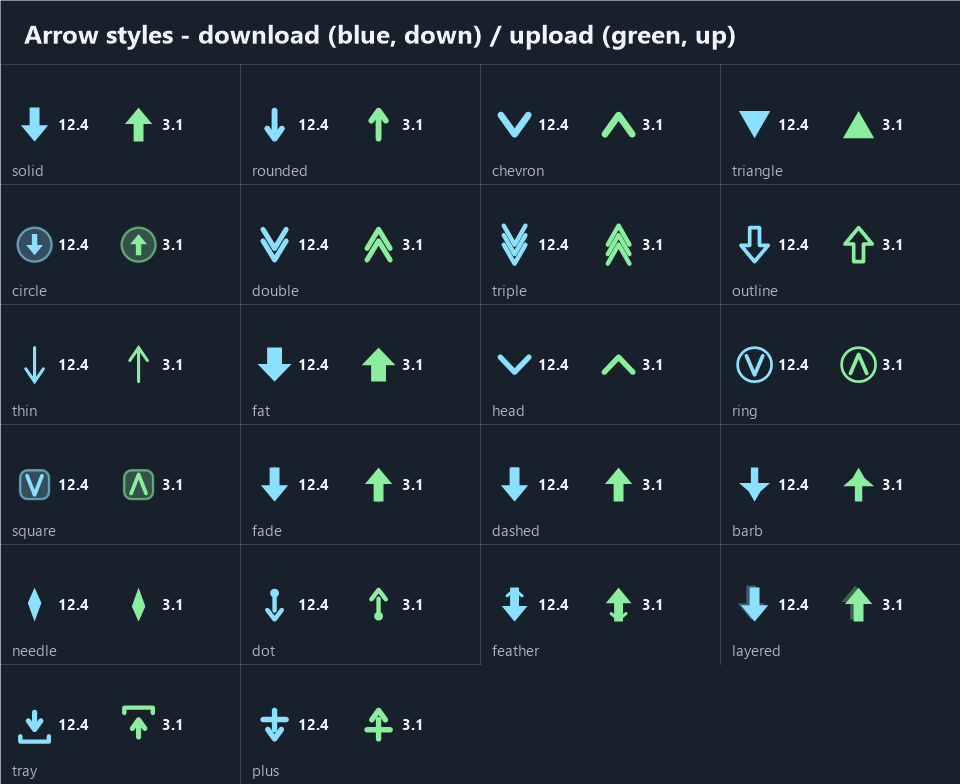

<div align="center">

# Taskbar Network Lounge

**A native network meter docked on the Windows 11 taskbar.**
Live download/upload speed, traffic totals, and an acrylic details panel — in the shell's own visual language.

[](https://windhawk.net)
[](https://github.com/cracken7/TaskbarNetworkLounge/releases/latest)
[](LICENSE)
[](https://en.cppreference.com/w/cpp/23)

**English** · [العربية](README.ar.md)

<br>


</div>

---

## Install

1. Install [Windhawk](https://windhawk.net) — it is the loader that runs this mod.
2. Download **[taskbar-network-lounge.wh.cpp](https://github.com/cracken7/TaskbarNetworkLounge/releases/latest/download/taskbar-network-lounge.wh.cpp)**.
3. In Windhawk: **Create a new mod** → select all → paste the file → **Compile mod**.

The meter appears on the taskbar within a few seconds. Step-by-step guide and
troubleshooting: **[INSTALL.md](INSTALL.md)**.

## Features

| | |
| --- | --- |
| **Live speed** | Download and upload, read from the real interface counters (`GetIfTable2`, IP Helper) divided by measured elapsed time (`QueryPerformanceCounter`). No `ipconfig`, `netstat` or PowerShell parsing. |
| **Traffic totals** | Per session, or persistent across Explorer/Windhawk/Windows restarts via a small checksummed file in `%LOCALAPPDATA%`. |
| **VPN-aware** | Tracks the single adapter holding the default route, so a VPN is followed while it carries the internet — never counted on top of its carrier. Totals reset when the source changes. |
| **Adjustable look** | 5 arrow styles, 4 text weights, font/arrow/widget/panel sizes, colours, acrylic tint, three layouts. |
| **Draggable divider** | Grab the line between the SPEED and TOTAL columns and move it — only the line moves, the text stays put. |
| **Details panel** | Click for interface, status, IPv4, speeds, totals and a Reset button. Tooltip on hover, context menu on right click. |
| **Bytes vs bits** | `MB/s` is megabytes per second, `Mbps` is megabits per second. The unit is always drawn next to the number. |
| **Bilingual UI** | Every setting name, description and dropdown option is translated to Arabic; Windhawk switches automatically with the Windows UI language. |
| **Cheap** | One API call per interval on a worker thread, repaint only when the numbers change. 0.3–0.5 % of one core, 27–31 MB, no handle leaks. |
| **Native** | One C++ DLL in `explorer.exe`. No console window, no WinForms/WPF, no Electron, no browser, no Python runtime. |



## Why the VPN case needed fixing

With a VPN running, the tunnel adapter and the physical adapter carry the same
bytes: the tunnel sees the plaintext, the NIC sees the encrypted copy. Summing
both reports a 1 GB download as 2 GB — the bug this mod was built to avoid.

Auto mode resolves the default route (`GetBestInterfaceEx`) against every real
adapter, then counts **exactly one**. So a VPN adapter is followed while it holds
the internet and dropped when it doesn't. And because a byte count carried over
from a different connection describes nothing, the totals reset when the source
changes — while a transient disconnect (Ethernet unplugged, tunnel not up yet) is
correctly *not* treated as a switch.

## Settings

<details>
<summary><b>Appearance</b></summary>

| Setting | Default | What it does |
| --- | --- | --- |
| Panel width / height | 220 × 52 | widget size at 100 % scaling |
| Font size | 13 | 13 measured sharpest; 11–12 for a smaller widget |
| Text weight | Bold | Bold / Black / Semibold / Regular |
| Arrow style | Rounded | Rounded / Solid / Chevron / Triangle / Circle |
| Arrow size | 120 % | of the font height; capped so it cannot overflow |
| SPEED / TOTAL captions | on | small captions above the two columns |
| Divider position | 50 % | splits the width between the two groups |
| Divider opacity | 46 | 0 hides the line |
| Drag the divider | on | grab the line and move it; only the line moves |
| Details panel width | 240 | pop-up panel size |
| Details panel height | 276 | a floor, not a fixed size — the panel grows if its content needs more room |
| Layout | full | speeds + totals / speeds only / one line |
| X / Y offset | 12 / 0 | position along the taskbar |
| Scale with DPI | on | multiply sizes by the monitor scaling |
| Auto theme | on | follow the Windows light/dark theme |
| Manual text colour | `0xFFFFFF` | used only when Auto theme is off |
| Coloured arrows | on | blue download, green upload |
| Acrylic tint opacity | 0 | 0 = pure glass |

</details>

<details>
<summary><b>Network</b></summary>

| Setting | Default | What it does |
| --- | --- | --- |
| Interface mode | Auto | Auto (default route) / Ethernet / Wi-Fi / All / Specific |
| Specific interface | — | name or part of the adapter name/description |
| Ignore virtual adapters | on | skip loopback, tunnels, VMware, Hyper-V, Docker, TAP. In Auto mode a VPN still wins when it carries the internet |
| Reset counters when the source changes | on | Ethernet → VPN → Wi-Fi zeroes the totals |
| Update interval | 1000 ms | 250–5000 |
| Speed unit | Auto | bytes (`MB/s`) or bits (`Mbps`) |
| 1024-based byte units | on | 1 MB = 1048576 B, like Explorer |

</details>

<details>
<summary><b>Traffic and behaviour</b></summary>

| Setting | Default | What it does |
| --- | --- | --- |
| Counter mode | Session | Session or Persistent (saved to disk) |
| Reset traffic counters | none | download / upload / both, applied once |
| Tooltip on hover | on | |
| Details panel on click | on | |
| Hide when fullscreen | off | |
| Start enabled | on | off = widget stays hidden |

</details>

## Architecture

```
src/p1_header.inc      metadata, @include explorer.exe, settings YAML (EN + AR)
src/p2_core.inc        headers, ModSettings, atomics/globals, menu IDs
src/p3_settings.inc    settings read + clamping, unit formatting, persistence
src/p4_network.inc     GetIfTable2 sampling, adapter filtering and selection,
                       source-change detection and counter reset
src/p5_render.inc      GDI+ painting: arrows, sharp text, widget + details panel
src/p6_window.inc      taskbar geometry, divider hit test, tooltip, context menu
src/p7_lifecycle.inc   window proc (incl. divider drag), Wh_ModInit/AfterInit
```

`build.sh` concatenates these into the single `taskbar-network-lounge.wh.cpp` that
Windhawk requires; `install.py` writes it into Windhawk and restarts the engine.

## Build and test

```bash
bash build.sh              # regenerate the .wh.cpp and compile a test DLL
bash tests/run_all.sh      # all seven offline suites
python install.py          # install into Windhawk and restart the engine
python tools/setopt.py --show
```

| Suite | What it proves |
| --- | --- |
| `test_netmon` | formatters, persistence round trip + corruption handling, live sampling |
| `test_geometry` | widget placement for every taskbar edge, multi-monitor |
| `test_render` | 1500 paint cycles leak no GDI/USER handles |
| `test_accuracy` | measured bytes vs the Windows performance counters |
| `test_styles` | every arrow style × text weight actually draws (Segoe UI Semibold/Black are separate font families — a wrong family silently draws nothing in GDI+) |
| `test_text` | text sharpness per rendering hint, size and weight |
| `test_fit` | worst-case string widths vs the available column width |
| `test_panel` | details-panel layout measured from the rendered pixels |

## Measurements

Ethernet (Realtek PCIe GbE), 1920 × 1080 at 100 %, Windows 11, Windhawk 1.7.3.

| | |
| --- | --- |
| Accuracy vs Windows counters | 1.0006 down / 1.0008 up over 22 s (0.06 %) |
| CPU | 0.09–0.14 s per 30 s ≈ 0.3–0.5 % of one core |
| RAM | 27–31 MB working set, ±60 KB drift |
| GDI / USER handles | +1 / +2 after 1500 paints |
| Text sharpness | 57.2 % fully saturated glyph pixels, 0 colour fringing |

Text rendering was tuned by measurement, not by eye: ClearType on acrylic produced
112 fringed pixels, so the mod uses greyscale `AntiAliasGridFit` plus a 1 px
contrast shadow, and `GenericTypographic` string formatting — the default adds
~1/6 em of side padding, which was clipping `12.4 MB/s`.

## Known limitations

- Attaches to the **primary** taskbar (`Shell_TrayWnd`); secondary taskbars are a
  fallback only.
- A vertical taskbar is handled in code but only verified offline.
- ARM64 is untested.
- "Hide widget" has no tray icon to bring it back — re-enable via
  Behavior → Start enabled.
- Speeds are sampled, so one reading can differ from Task Manager by a few
  percent; the average over a second matches.

## License

MIT — see [LICENSE](LICENSE).
